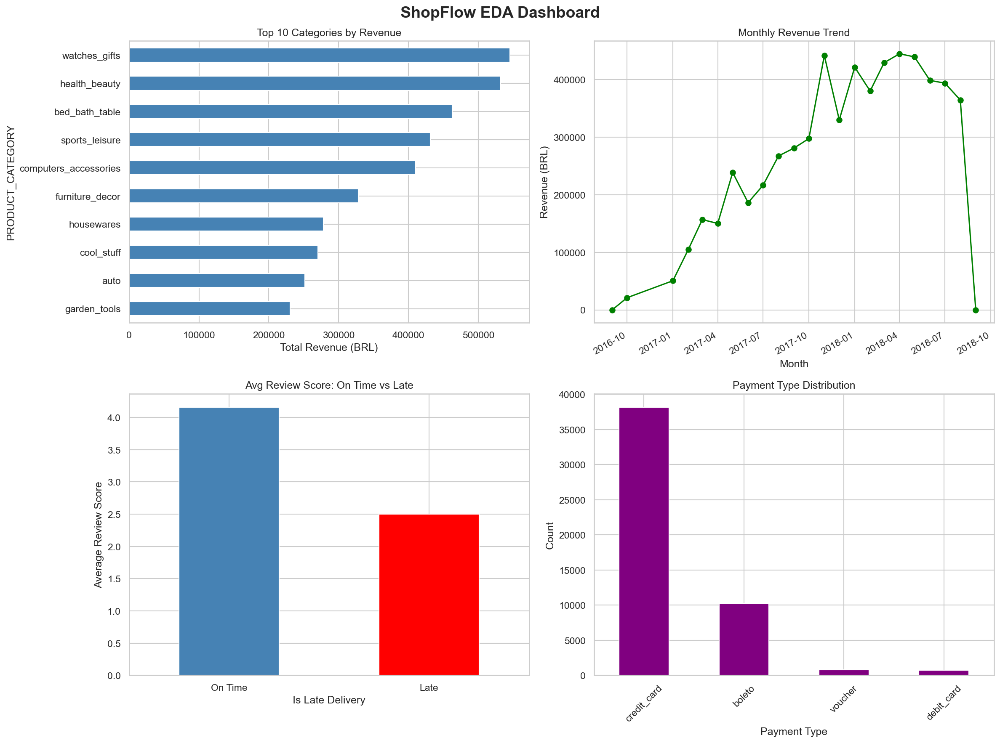
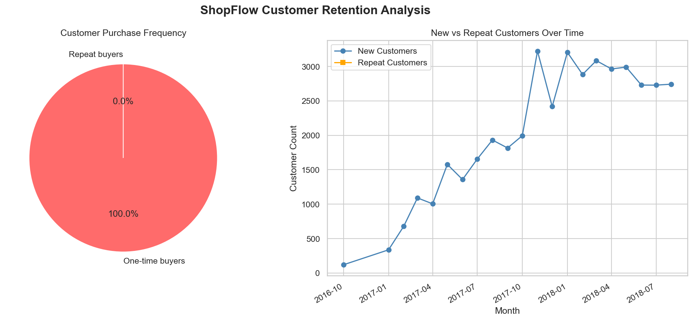
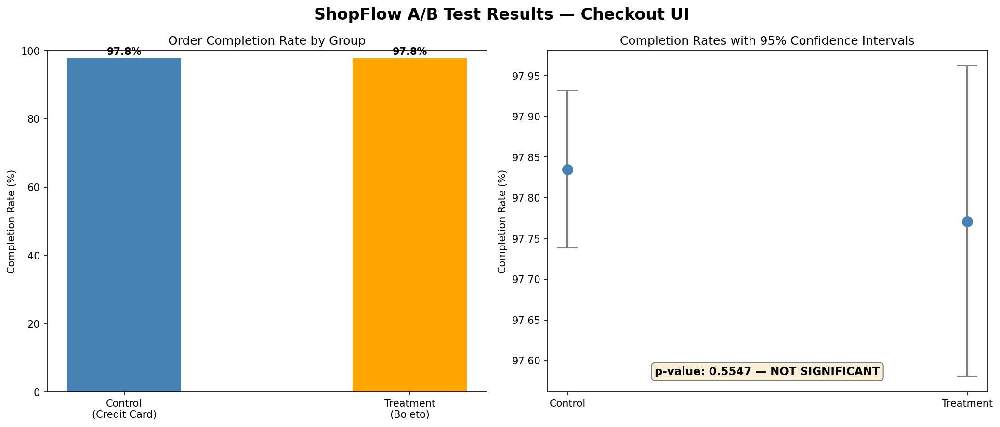
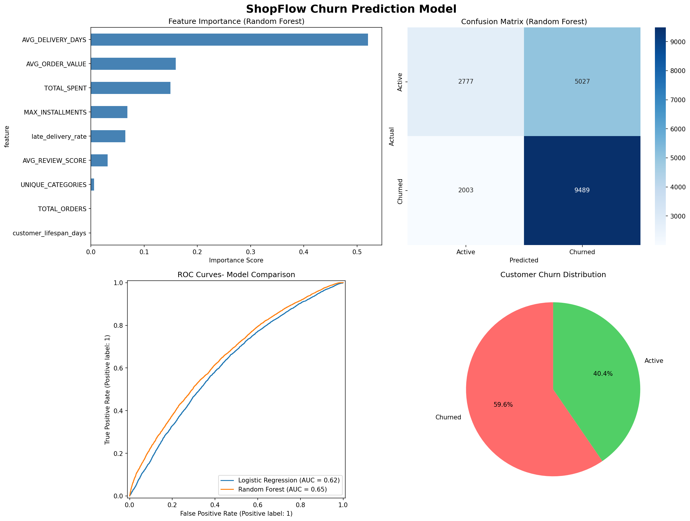
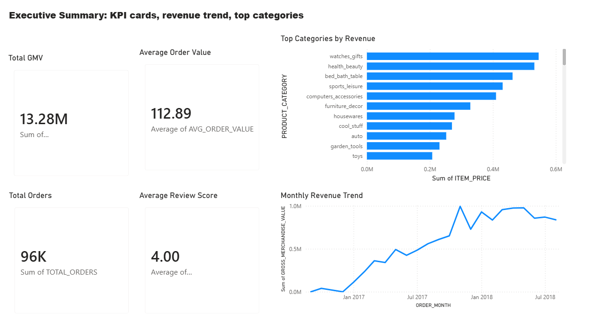
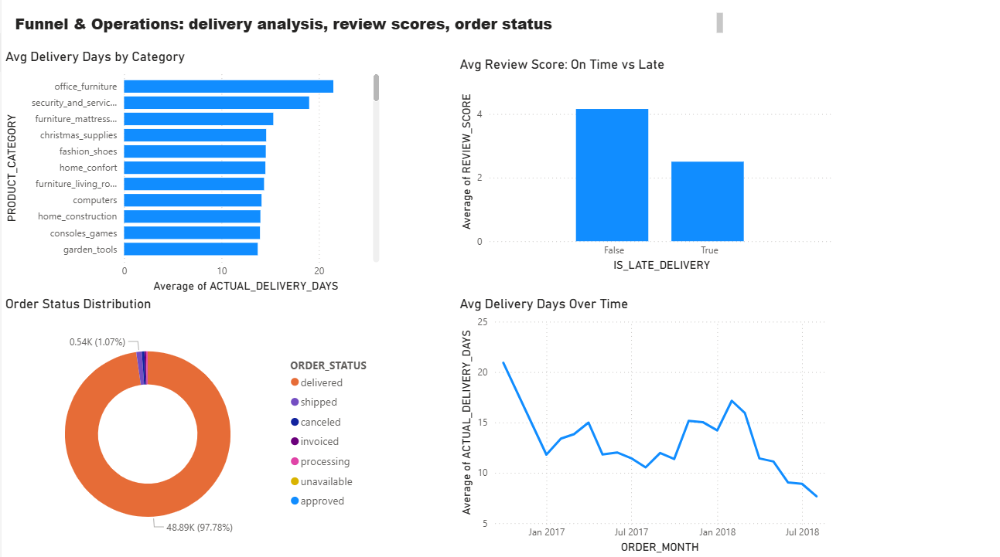
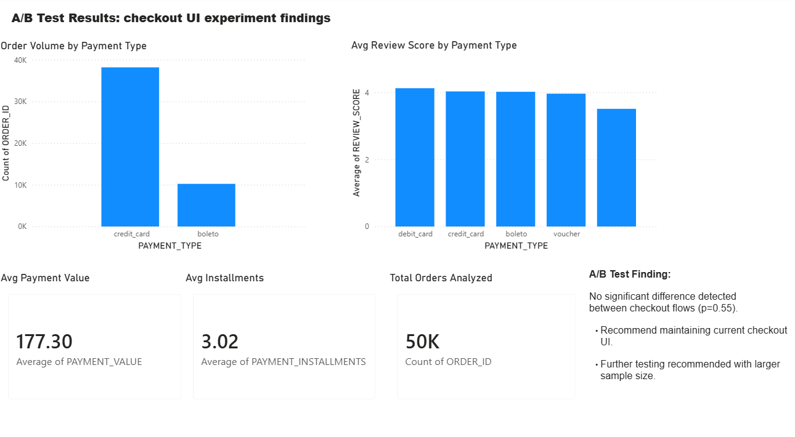

## ShopFlow Product Analytics

End-to-end product analytics project analyzing 113,000+ 
real e-commerce transactions to look into insights on 
revenue, delivery performance, customer retention, 
and churn prediction.

### Project Overview

ShopFlow is a fictional e-commerce brand built on top of 
a real Brazilian marketplace dataset (2016- 2018).

### Tech Stack

| Tool | Purpose |
|---|---|
| Snowflake | Cloud data warehouse |
| SQL | Data modeling and KPI queries |
| Python | EDA, statistical testing, ML |
| pandas / matplotlib / seaborn | Data analysis and visualization |
| scikit-learn | Churn prediction model |
| statsmodels | A/B test statistical significance |
| Power BI | Interactive dashboard |
| Git / GitHub | Version control |


### Project Architecture
```
Raw CSV Data (9 files, 113K+ rows)
        ↓
Snowflake RAW Layer
        ↓
Snowflake STAGING Layer (cleaned, typed, derived fields)
        ↓
Snowflake ANALYTICS Layer (fact table and dimensions)
        ↓
Python EDA + ML Models
        ↓
Power BI Dashboard and Executive Memo
```

### Key Findings

**Finding 1: Late Deliveries Destroy Satisfaction**
Customers who received late deliveries gave an average 
review score of 2.6 vs 4.1 for on-time deliveries, 
a 37% drop caused purely by delivery speed.

**Finding 2:  Near-Zero Customer Retention**
Virtually no customers made a repeat purchase, indicating 
the platform is entirely dependent on new customer 
acquisition for revenue growth.

**Finding 3: Checkout Flow Test Inconclusive**
Simulated A/B test comparing payment method groups 
showed no statistically significant difference 
(p=0.55). Methodology demonstration only.

### Churn Prediction Model

Built two models to predict customer churn:

| Model | ROC-AUC |
|---|---|
| Logistic Regression | 0.62 |
| Random Forest | 0.65 |

Top churn predictors:
1. Average delivery days (0.52 importance)
2. Average order value (0.16 importance)
3. Total spend (0.15 importance)

### Repository Structure
```
shopflow-analytics/
├── data/
│   ├── raw/              # Original CSV files
│   └── processed/        # Exported tables for Power BI
├── sql/
│   ├── staging/          # Staging layer SQL
│   └── kpis/             # Analytics layer SQL
├── notebooks/
│   ├── 01_eda.py         # Exploratory data analysis
│   ├── 02_ab_test.py     # A/B testing
│   └── 03_churn_model.py # Churn prediction ML
├── powerbi/
│   └── shopflow_dashboard.pbix
├── memo/
│   └── executive_summary.md
├── docs/
│   ├── eda_dashboard.png
│   ├── cohort_analysis.png
│   ├── ab_test_results.png
│   └── churn_model.png
├── .env.example
├── requirements.txt
└── README.md
```

### Dashboard Preview

#### Executive Summary


#### Cohort Retention Analysis


#### A/B Test Results


#### Churn Prediction Model


### Power BI Preview





### How to run this project

**1. Clone the repo**
```bash
git clone https://github.com/anumsagheer01/shopflow-analytics
cd shopflow-analytics
```

**2. Create virtual environment**
```bash
python -m venv venv311
venv311\Scripts\activate
pip install -r requirements.txt
```

**3. Set up credentials**
```bash
cp .env.example .env
# Add your Snowflake credentials to .env
```

**4. Run the analysis**
```bash
python notebooks/01_eda.py
python notebooks/02_ab_test.py
python notebooks/03_churn_model.py
```

### Data Source

Real transaction data from a Brazilian e-commerce 
marketplace, publicly available on Kaggle.
Dataset contains 100K+ orders across 2016–2018.